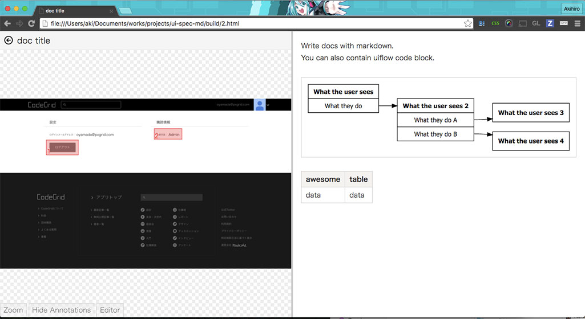
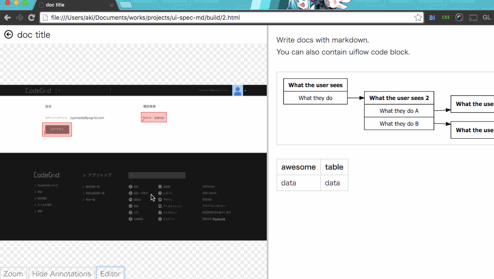

# UI Spec MD

UI Spec MD is the efficient markdown compiler for UI documentation with [UI Flows](https://signalvnoise.com/posts/1926-a-shorthand-for-designing-ui-flows) Graph.
UI Spec MD compiles special markdown with following features

- YAML header consists of the title and screen capture image path
- Github-flavored Markdown
- UI Flows code blocks

👉[Quick Start Example](https://github.com/pxgrid/ui-spec-md-example)

## UI Flow codeblock

When you make UI documentation, you may need to have UI Flows Graph

UI Spec MD arrows to contain special code blocks to draw UI Flows with markdown friendly easy syntax.
Here is a markdown example with the code block for UI Flows.

	---
	title: doc title
	screen: ./screen1.png?highlight=[[216,193,150,70],[720,140,130,50]]
	---

	Write docs with markdown.
	You can also contain uiflow code block.

	```uiflow
	[What the user sees]
	What they do
	==> What the user sees 2

	[What the user sees 2]
	What they do A
	==> What the user sees 3
	What they do B
	==> What the user sees 4
	```

	| awesome | table |
	| ---     | ---   |
	| data    | data  |


Here is the complied result example.



## Compile MD to HTML with gulp!

Example for gulp task

```
var gulp     = require( 'gulp' );
var uiSpecMd = require( 'ui-spec-md' );

gulp.task( 'md', function () {

  gulp.src( './src/**/*.md' )
      .pipe( uiSpecMd( { srcRoot: __dirname + '/src/' } ) )
      .pipe( gulp.dest('./build/' ) );

  // copy images as well
  gulp.src( [ './src/**/*.jpg', './src/**/*.png' ] )
      .pipe( gulp.dest( './build/' ) );

} );
```

# Highlight Editor

UI Spec MD comes with the Highlight Editor!
To launch the editor, just press Edit button on a documentation page.


